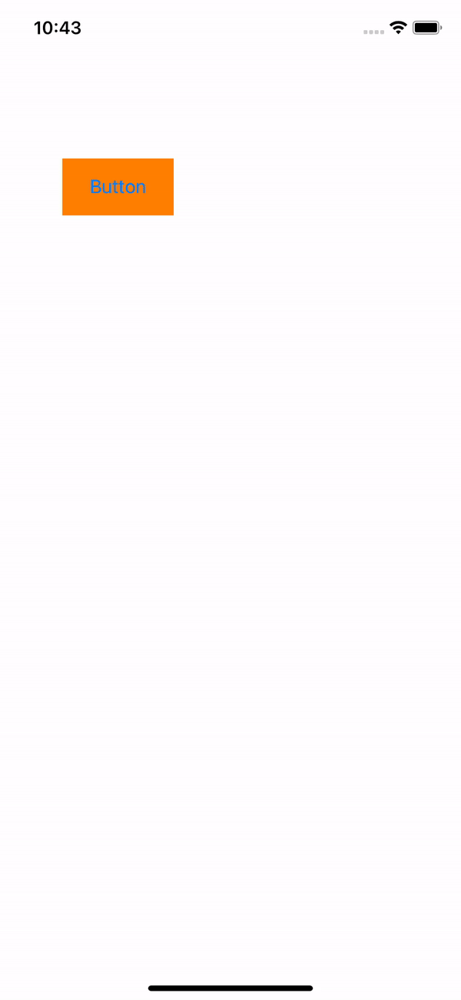
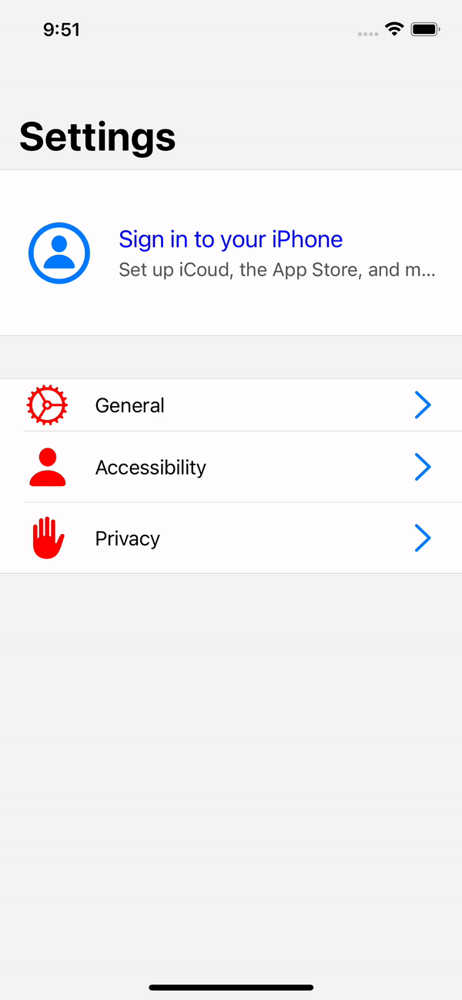
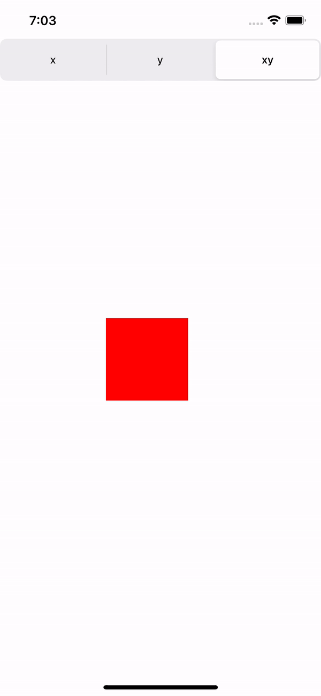
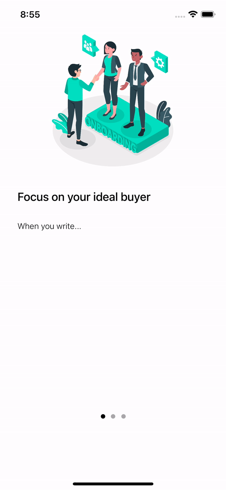

# iOSStudy
iOS 앱 개발 개인 스터디 공간입니다.

## 1. App Build Intro



버튼 클릭 시 같은 storyboard에 있는 ViewController를 화면에 띄워줍니다.

``` swift
let storyBoard = UIStoryboard(name: "Main", bundle: nil)
let detailViewController = storyBoard.instantiateViewController(identifier: "DetailViewController") as DetailViewController

self.present(detailViewController, animated: true, completion: nil)
```

## 2. Passing Data

### 2.1 ViewController 속성 값에 할당

``` swift
// passing data (데이터를 넘겨주는 방법)
// 6가지

// 1. instance property

import UIKit

class ViewController: UIViewController {
    var someString = ""
    
    override func viewDidLoad() {
        super.viewDidLoad()
        // Do any additional setup after loading the view.
    }

    @IBAction func moveToDetail(_ sender: Any) {
        let detailVC = DetailViewController(nibName: "DetailViewController", bundle: nil)
        detailVC.someString = "aaa 데이터"
        
        // 화면에 올라가기 전에 접근하면 에러가 발생
        // detailVC.someLabel.text = "bb"
        
        // present를 호출해야 화면에 올라갈 준비를 하기 때문에
        // present를 하기 전에 ui 요소에 접근을 하면 nil 에러가 발생
        self.present(detailVC, animated: true, completion: nil)
        
        // 보통 이런 방식으로 ui의 속성 값을 할당하지는 않는다.
        detailVC.someLabel.text = "bb"
        
    }
    
}
```

``` swift
import UIKit

class DetailViewController: UIViewController {
    
    // ViewController instance가 생성되는 시점에
    // 해당 속성 값을 할당해 주고
    // 해당 값을 ui에 할당하는 시점은 viewDidLoad() 이후
    // 즉 ui가 메모리에 올라가고 나서 할당해 주는 방식을 사용한다.
    var someString = ""
    
    // instance가 생성되는 시점에는 nil이다.
    // 단, 화면에 UI들이 올라갈 수 있도록 준비 되는 시점에 ui가 메모리에 올라간다.
    // 즉, viewDidLoad가 될 때 생성된다.
    @IBOutlet weak var someLabel: UILabel!
    
    override func viewDidLoad() {
        super.viewDidLoad()
        // super.viewDidLoad()가 호출됐을 때 someLabel이 메모리에 올라가기 때문에 접근할 때 문제가 없다.
        someLabel.text = someString
    }

}
```

### 2.2 segue를 통한 데이터 전달
하나의 스토리보드에 여러 ViewController가 있을 때 사용

``` swift
class ViewController: UIViewController {
    var someString = ""
    
    override func viewDidLoad() {
        super.viewDidLoad()
        // Do any additional setup after loading the view.
    }

    // prepare를 사용하면 연결된 segue로 이동할 때 호출이 된다.
    // 따라서 원하는 segue를 찾아서 해당 viewCotroller의 속성 값에 값을 할당할 수 있다.
    override func prepare(for segue: UIStoryboardSegue, sender: Any?) {
        if segue.identifier == "segueDetail" {
            if let detailVC = segue.destination as? SegueDetailViewController {
                detailVC.dataString = "adbc"
            }
        }
    }
}
```

### 2.3 instance를 통으로 넘겨서 데이터 전달하기

``` swift
class ViewController: UIViewController {
    @IBAction func moveToInstance(_ sender: Any) {
        let detailVC = InstanceDetailViewController(nibName: "InstanceDetailViewController", bundle: nil)
        
        detailVC.mainVC = self
        
        self.present(detailVC, animated: true, completion: nil)
    }
}
```

``` swift
class InstanceDetailViewController: UIViewController {
    
    var mainVC: ViewController?

    override func viewDidLoad() {
        super.viewDidLoad()

        // Do any additional setup after loading the view.
    }

    @IBAction func sendDataMainVC(_ sender: Any) {
        mainVC?.dataLabel.text = "some data"
        self.dismiss(animated: true, completion: nil)
    }
}
```

ViewController에서 버튼 클릭 시 InstanceDetailViewController를 가지고 온 다음 InstanceDetailViewController에서 들고 있는 mainVC: ViewController에 `self`를 할당함으로써 InstanceDetailViewController에 ViewController의 instance를 그대로 전달하면서 데이터 전달을 진행합니다.

### 2.4 delegate를 사용해서 data를 전달하는 방법

``` swift
// weak 키워드를 사용하기 위해서 AnyObject를 상속받아야 한다.
protocol DelegateDetailViewControllerDelegate: AnyObject {
    func passString(string: String)
}

class DelegateDetailViewController: UIViewController {
    
    // weak 타입으로 하는 이유
    // 해당 delegate의 정의가 내려지는 곳이 따로 있기 때문에
    // 그쪽에서 만들고 사용하고 끝나면 메모리 해제가 될 수 있도록 하기 위함
    weak var delegate: DelegateDetailViewControllerDelegate?
    
    override func viewDidLoad() {
        super.viewDidLoad()

        // Do any additional setup after loading the view.
    }

    @IBAction func passDataToMainVC(_ sender: Any) {
        delegate?.passString(string: "pass Data")
        self.dismiss(animated: true, completion: nil)
    }
}
```

delegate를 선언 방식으로 구현을 하고 실제로 버튼이 동작되는 부분에서 callback이 될 수 있도록 구현을 한다.
``` swift
class ViewController: UIViewController {
    @IBOutlet weak var dataLabel: UILabel!

    @IBAction func moveToDelegate(_ sender: Any) {
        let detailVC = DelegateDetailViewController(nibName: "DelegateDetailViewController", bundle: nil)
        
        // 나 자신을 통으로 넘기는 것이 아니라 extension으로 구현한 구현부만 넘기게 된다.
        // 즉 DelegateDetailViewControllerDelegate 타입만 넘기는 것이다.
        detailVC.delegate = self
        self.present(detailVC, animated: true, completion: nil)
    }
}

extension ViewController: DelegateDetailViewControllerDelegate {
    func passString(string: String) {
        self.dataLabel.text = string
    }
}
```
delegate를 전달하는 부분은 위와 같이 extension을 활용하여 해당 객체가 protocol를 구현할 수 있도록 하고 
self를 할당해 주면 된다.

### 2.5 Passing Data closure

Delegate 방식으로 다른 controller에 데이터를 전달하는 방식입니다.

``` swift
class ClosureDetailViewController: UIViewController {
    
    var myClosure: ((String) -> Void)?

    override func viewDidLoad() {
        super.viewDidLoad()
    }
    
    @IBAction func closurePassData(_ sender: Any) {
        myClosure?("closure string")
        self.dismiss(animated: true, completion: nil)
    }
}
```

``` swift
class ViewController: UIViewController {
    @IBOutlet weak var dataLabel: UILabel!
    @IBAction func moveToClosure(_ sender: Any) {
        let detailVC = ClosureDetailViewController(nibName: "ClosureDetailViewController", bundle: nil)
        
        detailVC.myClosure = { str in
            self.dataLabel.text = str
        }
        
        self.present(detailVC, animated: true)
    }
}
```

### 2.6 Notification
Add observer by Notification.Name, and call observer by post function of NotificationCenter.
And then, through the function added to observer, you can get notification that has key value pair.

``` swift 
class ViewController: UIViewController {
    var someString = ""
    
    override func viewDidLoad() {
        super.viewDidLoad()
        
        let notificationName = Notification.Name("sendSomeString")
        // Don't call 'addObserver' twtice
        NotificationCenter.default.addObserver(self, selector: #selector(showSomeString), name: notificationName, object: nil)
        
        // add observer before(will) showing keyboard
        NotificationCenter.default.addObserver(self, selector: #selector(keyboardWillShow), name: UIResponder.keyboardDidShowNotification, object: nil)
        
        // add observer show keyboard completed
        NotificationCenter.default.addObserver(self, selector: #selector(keyboardDidShow), name: UIResponder.keyboardDidShowNotification, object: nil)
        
        NotificationCenter.default.removeObserver(self, name: notificationName, object: nil)
    }
  
    @objc func showSomeString(notification: Notification) {
        if let str = notification.userInfo?["str"] as? String {
            self.dataLabel.text = str;
        }
    }

    @objc func keyboardWillShow() {
        print("will show")
    }
    
    @objc func keyboardDidShow() {
        print("did show")
    }
    


    @IBAction func moveToNoti(_ sender: Any) {
        let detailVC = NotiDetailViewController(nibName: "NotiDetailViewController", bundle: nil)
        self.present(detailVC, animated: true, completion: nil)
    }
}
```

``` swift
class NotiDetailViewController: UIViewController {

    override func viewDidLoad() {
        super.viewDidLoad()
        
    }

    @IBAction func notiAction(_ sender: Any) {
        let notificationName = Notification.Name("sendSomeString")
        
        let strDic = ["str" : "noti string"]
        
        NotificationCenter.default.post(name: notificationName, object: nil, userInfo: strDic)
        self.dismiss(animated: true)
    }
}
```
## 3. Dispatch Queue

## main thread vs work thread
``` swift
// dispatch queue -> like task of C#
// create thread's' for management

import UIKit

class ViewController: UIViewController {
    
    // to check main thread working properly
    @IBOutlet weak var timerLabel: UILabel!

    @IBOutlet weak var finishLabel: UILabel!
    
    override func viewDidLoad() {
        super.viewDidLoad()
        
        Timer.scheduledTimer(withTimeInterval: 0.1, repeats: true) { timer in
            self.timerLabel.text = Date().timeIntervalSince1970.description
            
        }
    }
    
    // run on main thread
    // why ui job works in main thread?
    // -> when ui state updated, one thread has to manage it.
    // if multi thread manage it, you hardly to check this.
    // And app life cycle run on main thread.
    @IBAction func action1(_ sender: Any) {
        // finishLabel.text = "end"
        // simpleClousure {
        // finishLabel.text = "end_closure"
        // }
        multiThreadClosure {
            
            self.finishLabel.text = "end_multThread"
        }
    }
    
    func simpleClousure(complection: () -> Void) {
        
        for index in 0..<10 {
            // stop main thread temporarily.
            Thread.sleep(forTimeInterval: 0.2)
            print(index)
        }
        
        complection()
    }
    
    func multiThreadClosure(complection: @escaping () -> Void) {
        
        // run on work thread
        DispatchQueue.global().async {
            for index in 0..<10 {
                Thread.sleep(forTimeInterval: 0.2)
                print(index)
            }
        }
        
        // run on main thread
        // ui must run on main thread
        DispatchQueue.main.async {
            complection()
        }
    }
    
    
    @IBAction func action2(_ sender: Any) {
        // simpleAction2()
        multiAction2()
        
    }
    
    // run on sync -> run on one thread
    func simpleAction2() {
        let dispatchGroup = DispatchGroup()
        
        // create a thread
        let queue1 = DispatchQueue(label: "q1")
        
        queue1.async(group: dispatchGroup) {
            for index in 0..<10 {
                Thread.sleep(forTimeInterval: 0.2)
                print(index)
            }
        }
        
        // run on sync -> run on one thread
        queue1.async(group: dispatchGroup) {
            for index in 10..<20 {
                Thread.sleep(forTimeInterval: 0.2)
                print(index)
            }
        }
        
        // run on sync -> run on one thread
        queue1.async(group: dispatchGroup) {
            for index in 20..<30 {
                Thread.sleep(forTimeInterval: 0.2)
                print(index)
            }
        }
    }
    
    // run on multi threads
    // run on async
    func multiAction2() {
        let dispatchGroup = DispatchGroup()
        
        // create multi threads
        let queue1 = DispatchQueue(label: "q1")
        let queue2 = DispatchQueue(label: "q2")
        let queue3 = DispatchQueue(label: "q3")
        
        // DispatchQoS.backgroud: the lowest priority
        // DispatchQoS.userInteractive: the highest priority.
        
        queue1.async(group: dispatchGroup, qos: .background) {
            // start job
            dispatchGroup.enter()
            DispatchQueue.global().async {
                for index in 0..<10 {
                    Thread.sleep(forTimeInterval: 0.2)
                    print(index)
                }
                // end job
                dispatchGroup.leave()
            }
        }
        
        queue2.async(group: dispatchGroup, qos: .userInteractive) {
            for index in 10..<20 {
                Thread.sleep(forTimeInterval: 0.2)
                print(index)
            }
        }
        
        queue3.async(group: dispatchGroup) {
            for index in 20..<30 {
                Thread.sleep(forTimeInterval: 0.2)
                print(index)
            }
        }
        
        // if all threads work finished, excute code block
        dispatchGroup.notify(queue: DispatchQueue.main) {
            print("end")
        }
    }
    
    @IBAction func action3(_ sender: Any) {
        // create multi threads
        let queue1 = DispatchQueue(label: "q1")
        let queue2 = DispatchQueue(label: "q2")
        
        queue1.sync {
            for index in 0..<10 {
                Thread.sleep(forTimeInterval: 0.2)
                print(index)
            }

            queue1.sync {
                for index in 0..<10 {
                    Thread.sleep(forTimeInterval: 0.2)
                    print(index;)
                }
            }
        }
        
        queue2.sync {
            for index in 10..<20 {
                Thread.sleep(forTimeInterval: 0.2)
                print(index)
            }
        }
        
        print("aaaa")
    }
}
```

## 4. Settings Clone App



model class를 기반으로 table view를 구성합니다.

### 4.1 table cell 선택 시 원하는 view controller 등장시켰던 방법
``` swift 
// 현재 테이블에서 선택된 열(cell) 데이터
func tableView(_ tableView: UITableView, cellForRowAt indexPath: IndexPath) -> UITableViewCell {
    
    if indexPath.section == 0 {
        let cell = tableView.dequeueReusableCell(withIdentifier: "ProfileViewCell", for: indexPath) as! ProfileViewCell
        
        // indexPath.section: 현재 세션 번호
        // indexPath.row: 현재 세션에서 열의 번호
        cell.topTitle.text = settingModel[indexPath.section][indexPath.row].menuIttile
        cell.profileImageView.image = UIImage(systemName: settingModel[indexPath.section][indexPath.row].leftImageName)
        cell.bottomDescription.text = settingModel[indexPath.section][indexPath.row].subTitle
        
        return cell
    }
    
    let cell = tableView.dequeueReusableCell(withIdentifier: "MenuViewCell", for: indexPath) as! MenuViewCell
    
    cell.leftImageView.image = UIImage(systemName: settingModel[indexPath.section][indexPath.row].leftImageName)
    cell.leftImageView.tintColor = .red
    cell.middleTitle.text = settingModel[indexPath.section][indexPath.row].menuIttile
    cell.rightImageView.image = UIImage(systemName: settingModel[indexPath.section][indexPath.row].rightImageName ?? "")
    
    return cell
}
```

table view의 현재 세션 > 셀을 토대로 보여줘야 하는 view controller 등장시키는 방식으로 진행함.\
-> 위 방법대로 진행되면 보여줘야 하는 셀이 하드코딩 되어 있기 때문에 좋은 방법으로 보여지지는 않습니다.\
-> 현재 선택한 cell의 id 및 view controller를 맵핑하는 방식으로 수정하면 조금 더 깔끔한 구현이 가능할 것 같습니다.

## 5. Pan Gesture App



### 5.1 Pan Gesture 등록

``` swift
init() {
    // frame: 기본 크기 설정
    super.init(frame: CGRect.zero)
    let pan = UIPanGestureRecognizer(target: self, action: #selector(dragging))
    self.addGestureRecognizer(pan)
}

// UIPanGestureRecognizer를 통해 PanGesture 값을 얻어올 수 있다.
@objc func dragging(pan: UIPanGestureRecognizer) {
    switch pan.state {
    // 누른 순간
    case .began:
        print("began")
    
    // 누르고 움직일 때
    case .changed:
        // 움직인 만큼의 값을 알려준다.
        // 현재 부모 뷰를 기준으로 얼만큼 이동했는지를 알려준다.
        let delta = pan.translation(in: self.superview)
        
        // 현재 view의 기준점을 center로 생각한다.
        var myPosition = self.center
        
        if dragType == .x {
            myPosition.x += delta.x
        } else if dragType == .y {
            myPosition.y += delta.y
        } else {
            myPosition.x += delta.x
            myPosition.y += delta.y
        }
        
        self.center = myPosition
        
        // 내가 움직인 만큼 이동을 끝낸 다음 pan을 초기화 해준다.
        pan.setTranslation(CGPoint.zero, in: self.superview)
        
    // ended: 움직임이 끝났을 때
    // cancelled: 누르고 멀리 이동하는 등, 이동이 취소 되었을 때
    case .ended, .cancelled:
        print("ended, cancelled")
        // minX: 해당 view의 좌측 상단 값
        // self.frame.minX < 0: 해당 view가 화면을 넘어가면
        if self.frame.minX < 0 {
            self.frame.origin.x = 0
        }
        if let hasSuperView = self.superview {
            // maxX: 해당 view의 우측 상단 값
            if self.frame.maxX > hasSuperView.frame.maxX {
                self.frame.origin.x = hasSuperView.frame.maxX - self.bounds.width
            }
        }

    default:
        break
    }
}
```

## 6. OnBoarding View




``` swift
class OnBoardingPageViewController: UIPageViewController {
    
    var pages = [UIViewController]()
    var bottomButtonMargin: NSLayoutConstraint?
    var pageControl = UIPageControl()
    
    let startIndex = 0
    var currentIndex = 0 {
        didSet {
            pageControl.currentPage = currentIndex
        }
    }
    
    func makePageVC() {
        let itemVC1 = OnBoardingItemViewController.init(nibName: "OnBoardingItemViewController", bundle: nil)
        itemVC1.mainText = "Focus on your ideal buyer"
        itemVC1.topImage = UIImage(named: "onboarding1")
        itemVC1.subText = "When you write..."
        
        let itemVC2 = OnBoardingItemViewController.init(nibName: "OnBoardingItemViewController", bundle: nil)
        itemVC2.mainText = "Entice with benefits"
        itemVC2.topImage = UIImage(named: "onboarding2")
        itemVC2.subText = "When we sell our .."
        
        let itemVC3 = OnBoardingItemViewController.init(nibName: "OnBoardingItemViewController", bundle: nil)
        itemVC3.mainText = "Avoid yeah.."
        itemVC3.topImage = UIImage(named: "onboarding3")
        itemVC3.subText = "When we're stuck..."
        
        pages.append(itemVC1)
        pages.append(itemVC2)
        pages.append(itemVC3)
        
        // 처음으로 나와야 하는 페이지 설정
        setViewControllers([itemVC1], direction: .forward, animated: true, completion: nil)
    }
    
    override func viewDidLoad() {
        super.viewDidLoad()
        
        self.makePageVC()
        self.makeBottomButton()
        self.makePageControl()
        
        self.dataSource = self
        self.delegate = self
    }
    
    func makeBottomButton() {
        print("make button")
        let button = UIButton()
        button.setTitle("확인", for: .normal)
        button.setTitleColor(.black, for: .normal)
        button.backgroundColor = UIColor.systemBlue
        
        // touchUpInside: 버튼을 클릭 후 땠을 때 호출
        button.addTarget(self, action: #selector(dismissPageVC), for: .touchUpInside)
        
        // 버튼을 view에 올리는 과정
        self.view.addSubview(button)
        // auto layout 설정을 위해서는 아래 값이 false로 설정이 되어 있어야 한다.
        button.translatesAutoresizingMaskIntoConstraints = false
        
        // code로 auto layout 설정
        // equalTo: 어디를 기준으로 anchor를 심을 것인지
        // self.view의 의미: 현재 View는 OnBoardingPageViewController이기 때문에 버튼이 부모 view를 기준으로 엥커를 심는 것이다.
        button.centerXAnchor.constraint(equalTo: self.view.centerXAnchor).isActive = true
        button.leftAnchor.constraint(equalTo: self.view.leftAnchor).isActive = true
        button.rightAnchor.constraint(equalTo: self.view.rightAnchor).isActive = true
        button.heightAnchor.constraint(equalToConstant: 50).isActive = true
        
        bottomButtonMargin = button.bottomAnchor.constraint(equalTo: self.view.safeAreaLayoutGuide.bottomAnchor, constant: 100)
        bottomButtonMargin?.isActive = true
        hideButton()
    }
    
    func makePageControl() {
        self.view.addSubview(pageControl)
        pageControl.translatesAutoresizingMaskIntoConstraints = false
        // 선택한 페이지의 점색상
        pageControl.currentPageIndicatorTintColor = .black
        // 선택되지 않은 페이지의 점색상
        pageControl.pageIndicatorTintColor = .lightGray
        // 점의 갯수
        pageControl.numberOfPages = pages.count
        pageControl.currentPage = startIndex
        
        // 점을 클릭 시 아무런 동작도 안하게끔 만들어줌
//        pageControl.isUserInteractionEnabled = false
        
        pageControl.bottomAnchor.constraint(equalTo: self.view.safeAreaLayoutGuide.bottomAnchor, constant: -80).isActive = true
        pageControl.centerXAnchor.constraint(equalTo: self.view.centerXAnchor).isActive = true
        
        // button의 이벤트 등록과 동일한 구현
        pageControl.addTarget(self, action: #selector(pageControlTapped), for: .valueChanged)
    }
    
    @objc func dismissPageVC() {
        self.dismiss(animated: true)
    }
    
    @objc func pageControlTapped(sender: UIPageControl) {
        
        // 1 -> 2 페이지로 이동
        if sender.currentPage > self.currentIndex {
            self.setViewControllers([pages[sender.currentPage]], direction: .forward, animated: true, completion: nil)

        } else {
            self.setViewControllers([pages[sender.currentPage]], direction: .reverse, animated: true, completion: nil)

        }
        
        currentIndex = sender.currentPage
        
        buttonPresentationStyle()
    }
}

extension OnBoardingPageViewController: UIPageViewControllerDataSource {
    // 현재 페이지에서 이전 페이지로 이동했을 시 나오는 페이지 정의
    // pageViewController: 현재 페이지
    func pageViewController(_ pageViewController: UIPageViewController, viewControllerBefore viewController: UIViewController) -> UIViewController? {
        guard let currentIndex = pages.firstIndex(of: viewController) else {
            return nil
        }
        
        self.currentIndex = currentIndex
        
        if currentIndex == 0 {
            return pages.last
        } else {
            return pages[currentIndex - 1]
        }
        
    }
    
    // 현재 페이지에서 이후 페이지로 이동했을 시 나오는 페이지 정의
    // pageViewController: 현재 페이지
    func pageViewController(_ pageViewController: UIPageViewController, viewControllerAfter viewController: UIViewController) -> UIViewController? {
        guard let currentIndex = pages.firstIndex(of: viewController) else {
            return nil
        }
        
        if currentIndex == pages.count - 1 {
            return pages.first
        } else {
            return pages[currentIndex + 1]
        }
    }
}

extension OnBoardingPageViewController: UIPageViewControllerDelegate {
    func pageViewController(_ pageViewController: UIPageViewController, didFinishAnimating finished: Bool, previousViewControllers: [UIViewController], transitionCompleted completed: Bool) {
        guard let currentVC = pageViewController.viewControllers?.first else {
            return
        }
        
        guard let currentIndex = pages.firstIndex(of: currentVC) else {
            return
        }
        self.currentIndex = currentIndex
        
        buttonPresentationStyle()

    }
    func buttonPresentationStyle() {
        if currentIndex == pages.count - 1 {
            self.showButton()
        } else {
            self.hideButton()
        }
        
        // 버튼이 등장하고 사라지는 첫 번째 방법
//        UIView.animate(withDuration: 0.5, delay: 0) {
//            self.view.layoutIfNeeded()
//        }
        
        // 버튼이 등장하고 사라지는 두 번째 방법
        UIViewPropertyAnimator.runningPropertyAnimator(withDuration: 0.25, delay: 0, options: [.curveEaseInOut], animations: {
            // 즉시 변경 -> 0.5초 동안의 시간을 두고
            self.view.layoutIfNeeded()
        }, completion: nil)
    }
    
    func showButton() {
        bottomButtonMargin?.constant = 0
    }
    
    func hideButton() {
        bottomButtonMargin?.constant = 100
    }
}

```

## 7. Photo Gallery


### 7.1 갤러리 접근 권한 확인 방법

``` swift
@objc func checkPermission() {
    // authorized: 모두 허용
    // limited: 일부 허용
    if PHPhotoLibrary.authorizationStatus() == .authorized ||
        PHPhotoLibrary.authorizationStatus() == .limited {
        DispatchQueue.main.async {
            // UI를 보여주는 것은 메인 쓰레드에서 동작을 해야 한다.
            self.showGallery()
        }
        
    // denied: 거절
    } else if PHPhotoLibrary.authorizationStatus() == .denied {
        DispatchQueue.main.async {
            self.showAuthorizationDeniedAlert()
        }
        
    // notDetermined: 한 번도 권한을 물어보지 않은 상태
    } else if PHPhotoLibrary.authorizationStatus() == .notDetermined {
        PHPhotoLibrary.requestAuthorization { status in
            self.checkPermission()
        }
    }
}

func showAuthorizationDeniedAlert() {
    let alert = UIAlertController(title: "포토라이브러리 접근 권한을 활성화 해주세요.", message: nil, preferredStyle: .alert)
    alert.addAction(UIAlertAction(title: "닫기", style: .cancel, handler: nil))
    alert.addAction(UIAlertAction(title: "설정으로 가기", style: .default, handler: { action in
        // 앱 설정 열기
        guard let url = URL(string: UIApplication.openSettingsURLString) else {
            return
        }
        if UIApplication.shared.canOpenURL(url) {
            UIApplication.shared.open(url, options: [:], completionHandler: nil)
        }
    }))
    self.present(alert, animated: true, completion: nil)
}

@objc func showGallery() {
    let library = PHPhotoLibrary.shared()
    var configuration = PHPickerConfiguration(photoLibrary: library)
    configuration.selectionLimit = 10
    let picker = PHPickerViewController(configuration: configuration)
    
    picker.delegate = self
    present(picker, animated: true, completion: nil)
}

@objc func refresh() {
    self.photoCollectionView.reloadData()
}
```

### 7.2 갤러리에서 선택한 이미지 불러오기
``` swift
class ViewController: UIViewController {
    var fetchResults: PHFetchResult<PHAsset>?
}

// table view이 기본 형태
// 연결된 table view의 갯수 및 현재 cell에 대해서 정의해 주고 있다.
extension ViewController: UICollectionViewDataSource {
    func collectionView(_ collectionView: UICollectionView, numberOfItemsInSection section: Int) -> Int {
        return self.fetchResults?.count ?? 0
    }
    
    func collectionView(_ collectionView: UICollectionView, cellForItemAt indexPath: IndexPath) -> UICollectionViewCell {
        let cell = collectionView.dequeueReusableCell(withReuseIdentifier: "PhotoCell", for: indexPath) as! PhotoCell
        if let asset = self.fetchResults?[indexPath.row] {
            cell.loadImage(asset: asset)
        }
        
        return cell
    }
}

// 사진 선택(add) 후 콜백처리
extension ViewController: PHPickerViewControllerDelegate {
    func picker(_ picker: PHPickerViewController, didFinishPicking results: [PHPickerResult]) {
        
        let identifiers = results.map {
             $0.assetIdentifier ?? ""
        }
        self.fetchResults = PHAsset.fetchAssets(withLocalIdentifiers: identifiers, options: nil)
        // 갯수가 업데이트 됨
        self.photoCollectionView.reloadData()
        
        self.dismiss(animated: true)
    }
}

class PhotoCell: UICollectionViewCell {
    
    @IBOutlet weak var photoImageView: UIImageView! {
        didSet {
            photoImageView.contentMode = .scaleAspectFill
        }
    }
    
    func loadImage(asset: PHAsset) {
        let imageManager = PHImageManager()
        let scale = UIScreen.main.scale
        // scale을 곱하는 이유 -> 핸드폰 해상도와 맞추기 위해서
        let imageSize = CGSize(width: 150 * scale, height: 150 * scale)
        
        let options = PHImageRequestOptions()
        // .highQualityFormat: 이미지를 요청할 때 고화질로 요청
        // .fastFormat: 이미지를 요청할 때 저화질로 요청
        // .opportunistic: 저화질 고화질 모두 요청
        options.deliveryMode = .opportunistic
        
        self.photoImageView.image = nil
        
        imageManager.requestImage(for: asset, targetSize: imageSize, contentMode: .aspectFill, options: options) { image, info in
            
            if (info?[PHImageResultIsDegradedKey] as? Bool) == true {
                // 저화질
            } else {
                // 고화질
            }
            self.photoImageView.image = image
            
        }
    }
}

```